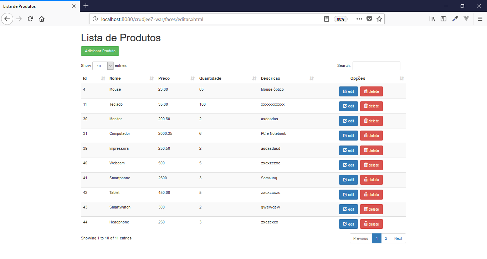
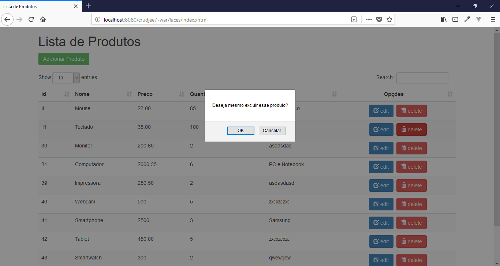

# Products

Project of register Products developed with Java EE.

## Features

- CRUD
- MVC
- ORM
- EJB
- JPA
- JSF

## Requirements

- NetBeans 8.2
- Java EE
- Glassfish = 4.1
- MySql >=5

## Tecnologies

- Java
- CSS
- JS
- MySql

## Installation

```
$ git clone https://github.com/danilomeneghel/crudjee7.git

$ cd crudjee7

```

Then create a database with name crud_jee in your mysql. You can find database dump in crud_jee.sql, import it:

```
$ mysql -u <your user> -p <your password>

mysql> create database `crud_jee`;

mysql> use `crud_jee`;

mysql> source crud_jee.sql

```

## Glassfish Configuration

1- Download the more stable version of Glassfish 4.1 and import it into NetBeans (the default version of NetBeans may give error). <br>
http://download.java.net/glassfish/4.1/release/glassfish-4.1.zip <br>
2- Create the Java EE project (Enterprise Application) without creating any new classes. <br>
3- After, click on "Clean and Build Project". When successful, click on "Run Project". <br>
This will cause Glassfish to start. <br>
4- Now open the Glassfish by accessing the browser: http://localhost:4848/ <br><br>

Go to "Resources/JDBC/JDBC Connection Pools", create the connection to the database (pool). <br>
Note: When creating the Pool it is necessary to put the connection data with mysql, but the password can not be empty (create a new user with a password). <br><br>

Then go to "Resources/JDBC/JDBC Resources", create a name for "jndi" (CrudJEE7) and select the previously created pool.<br><br>

After you finish configuring, just open NetBeans and run the project in the browser. <br>
http://localhost:8080/crudjee7-war/

## License

Office is licensed under <a href="LICENSE">The MIT License (MIT)</a>.

## Screenshots

<br><br>
<br><br>
<br><br>
<br><br>
